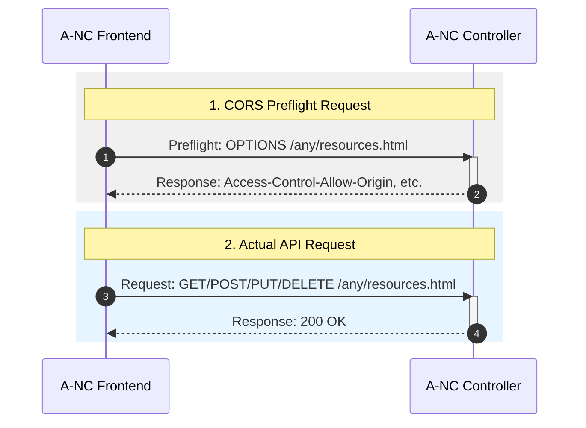

# Dot Env File Empty Space Bug Issue

**Note: This is a sanitized version of the original case study, some sensitive information has been removed. Also only a partial of the source code has been included for demonstration purpose only.**

## Overview & Background
This case study is a very simple and dumb but yet tricky to identify and resolve issue. The issue is first found by one of our team QA member that states the said IP address of our web based A-NC application when accessed through the browser, opens an empty page, which should not be the case.

The design of the A-NC contains mainly 2 components, the A-NC frontend container(s) and the A-NC controller. They both have their web server being hosted on each other. In order for the A-NC frontend to display necessary information, it needs to communicate with the A-NC controller to retrieve the data through RESTful APIs, websocket etc from the controller. 

However since they are of different domain, cross-origin resource sharing (CORS) is configured on the controller side to allow the frontend to access the controller's API (by whitelisting the frontend's domain).

Below shows a simple sequence diagram of a normal CORS flow taking into account our A-NC architecture.



## Symptoms and Diagnosis
The browser shows empty page with CORS error in the console. Double checking the server settings in the A-NC controller, the CORS configuration seems correct. Allowing the frontend's domain to access the controller's API through the dot env file variable substitution. 

Turn out the issue orginates from a previous commit, I added comments on the `.env` file to explain the purpose of each variable, however I left a trailing space after the comment, which causes the variable substitution to substitute a `%20` into the URL, which causes the CORS to fail.

This is a very tricky to identify and resolve issue, as the browser does not show the actual URL being requested, it only shows the base URL. The only clue I found at the end is from the Chrome's devtool's network tab, I noticed the request URL contains a `%20` in the middle of the URL, which is a hint that there is a space in the URL. 

Here is the problematic `.env` file snippet:
```
PORT=5000 # This is the port you want to access the web interface

REACT_APP_FRONTEND_PORT=8080 # This should match with p2_controller's DJANGO_WEB_PORT

REACT_APP_FRONTEND_HOSTNAME=10.240.0.254 # This is the IP where you want to access the anc user interface in web browser, usually this is the host IP
```

Note the trailing space after the comment causes the variable substitution to substitute a `%20` into the URL. Removing the trailing space resolves the issue.

And the below is the corrected `.env` file snippet:

```
# This is the port you want to access the web interface
PORT=5000

# This should match with p2_controller's DJANGO_WEB_PORT
REACT_APP_FRONTEND_PORT=8080

# This is the IP where you want to access the anc user interface in web browser, usually this is the host IP
REACT_APP_FRONTEND_HOSTNAME=10.240.0.254
```

# Lessons Learned
1. Always be aware of the trailing space when editing the `.env` file, as it can cause unexpected behavior.
2. Always double check the URL being requested in the browser's devtool's network tab, as it can provide valuable clues to identify the issue.