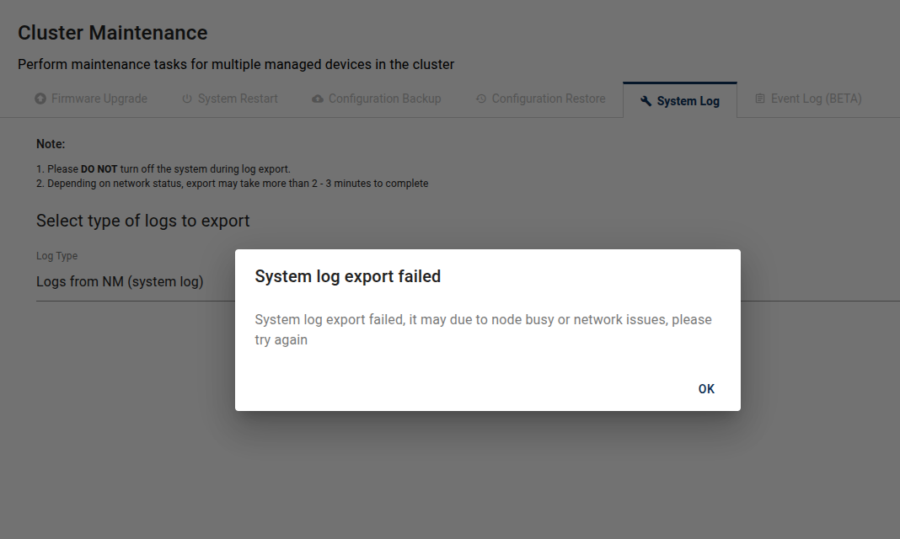
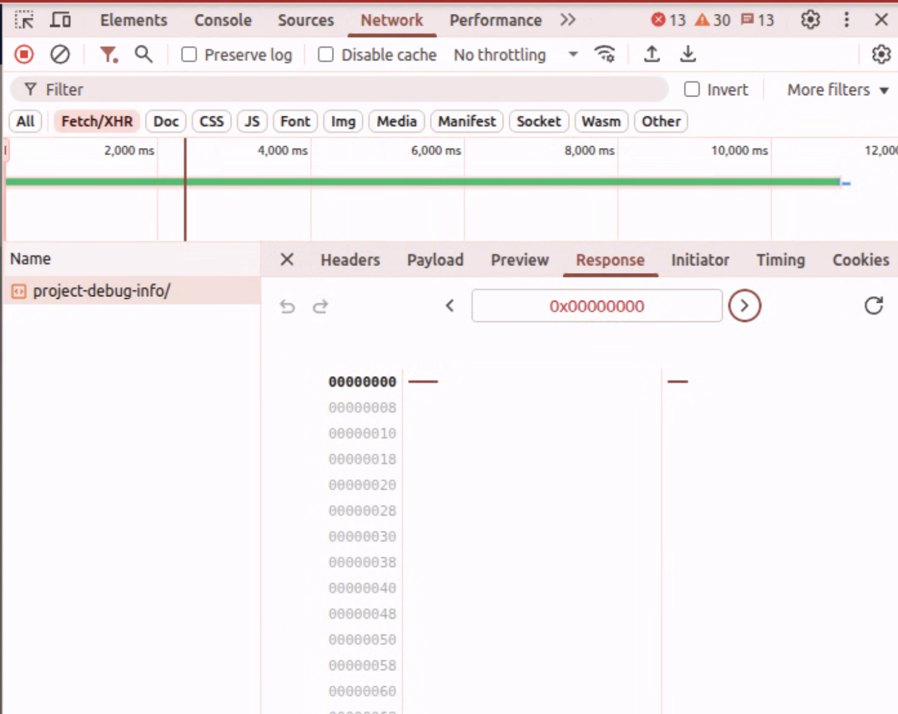

# A-NC System Log Export Failed Pop up File Selector

**Note: This is a sanitized version of the original case study, some sensitive information has been removed. Also only a partial of the source code has been included for demonstration purpose only.**

## Overview & Background
A-NC (a.k.a Anywhere Node Controller) is a next generation product of NWJS Windows based A-NM (a.k.a Anywhere Node Manager), the evolve from NWJS based code base to pure web based A-NC caused numerious code refactoring for the change of behavior of native application to pure web based application. Here is one of the bug I encountered related to file selector mechanism differences between two.


## Symptoms and Diagnosis
Below shows the error dialog box of failing to export the selected logs.  


### Diagnosis 1: From the perspective of docker compose logs
First I check the Django server side to see whether the RESTful API works as expected.

```bash
HTTP POST /api/v8/projects/2ea1c36e-d179-4585-bf35-6bc03f523e07/project-debug-info/ 200 [10.52, 10.240.0.254:59008]
HTTP POST /api/v8/projects/2ea1c36e-d179-4585-bf35-6bc03f523e07/project-debug-info/ 200 [7.56, 10.240.0.254:59008]
```

Judging from the docker compose log, the target `/project-debug-info` is return 200 which turns out the response is success.

### Diagnosis 2: From the perspective of browser HTTP response log
Next I check from the browser side to see whether the return response actually contains the file content (represented in binary)


The sequences of zeros and numbers represents the Django server actually replies with binaries (the file). The only problem left is how frontend handle the http response.

### Diagnosis 3: From the perspective of how frontend handle the HTTP response
Refer to the target API handling functions `getProjectDebugInfo` before bug fixing, we can see that the `match` function to capture the HTTP `Content-Disposition` header is not handling comprehensively. Judging from the regular expression used, it only captures the first capturing group to retrieve the file name which is not enough, since there may be chance of `undefined` when the first capturing group is not able to capture anything.

```js
export async function getProjectDebugInfo(csrf, projectId, body) {
        try {
        const _body = {
            ...body,
            uiVersion: process.env.REACT_APP_UI_DISPLAY_VER ?? 'dev',
        };
        const res = await restfulApiCall('project-debug-info', csrf, projectId, _body);

        if (res.status === 200) {
            const ctx = await res.blob();
            const re = /filename="(\S+)"/;
            const filename = res.headers.get('Content-Disposition').match(re)[1];
            const result = {
                success: true,
                data: {
                    filename,
                    file: ctx,
                },
            };
            return result;
        }
        const failObj = {
            success: false,
            errors: [{type: 'Server error'}],
        };
        return Promise.reject(failObj);
    } catch (e) {
        throw e;
    }
}
```

We need to use the full return of the match command, and also capture the non ASCII code file name (the RFC 5987 format) to cover all the naming possibilities. We also need to make sure not only do the `match[0]` is not undefined, but the `match[1]` too.

The reason why it shows failure is due to accessing the match array not existed `match[1]`, and immediately reject the promise.

By adding 3 patterns covering all possibilities, we are sure that even when the file name is not matched for all 3 patterns, we can still have the default name to serve and when the file name is always assigned when passed to `decodeURIComponent` for file name conversion.


# Lessons Learned
1. Always check all possibilities of file name when handling the return of HTTP response from server.
2. Always check and make sure the capturing group captured the desired name from the HTTP response before extracting the file name.
3. `decodeURIComponent` is necessary to decode the URI text string to a readable file naming.